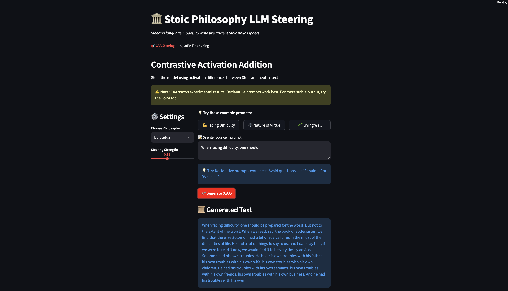
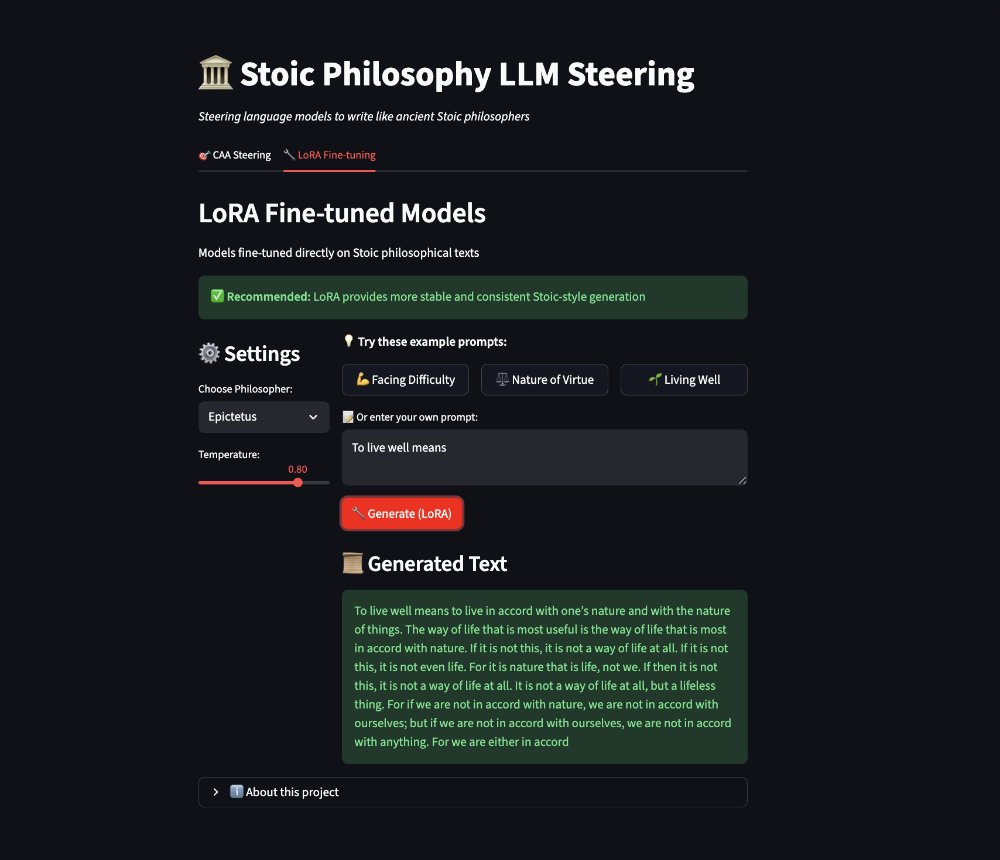

# 🏛️ Stoic LLM Steering

Steering language models to write like ancient Stoic philosophers using **Contrastive Activation Addition (CAA)** and **LoRA fine-tuning**.


---

## 📖 Overview

This project explores two techniques for steering a language model (Llama-3.2-1B) to generate text in the style of ancient Stoic philosophers:

1. **Contrastive Activation Addition (CAA)** - Extracts activation differences between Stoic and neutral text to create steering vectors
2. **LoRA Fine-tuning** - Parameter-efficient fine-tuning directly on classical Stoic texts

The project includes a complete data pipeline, model training, and an interactive Streamlit demo for comparing both approaches.

---

## ✨ Features

- 📚 **Automated data collection** from Project Gutenberg
- 🤖 **Neutral text generation** using Claude API
- 🎯 **CAA steering implementation** with adjustable coefficients
- 🔧 **LoRA fine-tuning** for three philosophers (Marcus Aurelius, Seneca, Epictetus)
- 🎨 **Interactive Streamlit demo** with side-by-side comparison
- 📊 **Systematic experimentation** across layers and hyperparameters

---

## 🚀 Quick Start

### Prerequisites
```bash
python 3.11+
conda or venv
```

### Installation

1. **Clone the repository**
```bash
git clone https://github.com/SebastianVillalobosAlva/Stoic-LLM-Steering.git
cd Stoic-LLM-Steering
```

2. **Create and activate environment**
```bash
conda create -n stoic-llm python=3.11
conda activate stoic-llm
```

3. **Install dependencies**
```bash
pip install -r requirements.txt
```

4. **Set up API key**
```bash
# Create .env file
echo "ANTHROPIC_API_KEY=your_key_here" > .env
```

### Running the Demo
```bash
streamlit run streamlit_app.py
```

Navigate to `http://localhost:8501` to interact with the demo!

---

## 🏗️ Project Structure
```
Stoic-LLM-Steering/
├── packages/
│   ├── text_downloader/       # Project Gutenberg scraping
│   ├── paraphraser/           # Claude API neutral text generation
│   ├── steering_extractor/    # CAA steering vector extraction
│   ├── steering_runner/       # CAA inference
│   └── lora_trainer/          # LoRA fine-tuning
├── scripts/                   # Executable scripts
├── data/
│   ├── raw_texts/            # Downloaded Gutenberg texts
│   ├── processed/            # Stoic-neutral pairs
│   ├── steering_vectors/     # CAA vectors
│   └── lora_training/        # LoRA training data
├── lora_models/              # Trained LoRA adapters
├── streamlit_app.py          # Interactive demo
└── README.md
```

---

## 📊 Technical Approach

### 1. Data Pipeline

**Text Collection**
- Scraped classical Stoic texts from Project Gutenberg
- Philosophers: Marcus Aurelius, Seneca, Epictetus
- Filtered bibliographic content and religious passages

**Neutral Paraphrasing**
- Used Claude API to generate neutral versions of Stoic texts
- Created 30 contrastive pairs per philosopher
- Maintained semantic content while removing stylistic markers

### 2. Contrastive Activation Addition (CAA)

**Methodology**
```python
# Extract activations from last layer
stoic_activations = model(stoic_text)[-1]
neutral_activations = model(neutral_text)[-1]

steering_vector = mean(stoic_activations - neutral_activations) # Compute steering vector
output = mlp_output + coefficient * steering_vector # Apply at layer 12 during generation
```

**Optimal Settings**
- **Layer:** 12 (balanced between style and coherence)
- **Coefficient:** 0.08-0.11 (stronger = more influence, less coherence)

### 3. LoRA Fine-tuning

**Results**
- More stable generation than CAA
- Better preservation of philosophical concepts
- Less sensitive to prompt phrasing

---

## 📈 Key Findings

### CAA vs LoRA Comparison

| Aspect | CAA | LoRA |
|--------|-----|------|
| **Training Time** | None (zero-shot) | ~15 min per philosopher |
| **Stability** | Moderate (prompt-sensitive) | High |
| **Style Transfer** | Weak-moderate | Strong |
| **Flexibility** | Adjustable at inference | Fixed after training |
| **Best Use Case** | Quick experiments | Production deployment |

### Challenges

1. **Small base model (1B params)** struggles with style preservation
2. **Religious content overlap** - Classical texts contain theological language that bleeds into steering
3. **Prompt sensitivity** - Declarative prompts work better than questions
4. **Data quality** - Only 30 pairs per philosopher limits steering strength

---

## 🎯 Results

### CAA Steering (Epictetus, coefficient=0.11)

**Prompt:** "When facing difficulty, one should"

**Output:**
> "When facing difficulty, one should not be afraid to admit it to oneself and others. In my own case, I am always a little ashamed of my weakness, and have a tendency to hide my weaknesses by doing a great deal of work. However, I am afraid that I have to be more honest about my weaknesses, lest I become a slave to my own weakness..."

### LoRA Fine-tuning (Marcus Aurelius)

**Prompt:** "To live well means"

**Output:**
> "To live well means to live according to nature, to follow reason, and to accept what cannot be changed. The wise man understands that external events are neither good nor bad, but his judgments make them so..."

---

## 🛠️ Reproducibility

### Generate Neutral Pairs
```bash
python -m scripts.text_downloader.main
```

### Extract CAA Steering Vectors
```bash
python -m scripts.steering_extractor.main
```

### Train LoRA Models
```bash
python -m scripts.lora_trainer.main
```

### Test Steering
```bash
python -m scripts.steering_runner.main
```

---

## 🎨 Demo

### Interactive Streamlit Interface

### CAA Steering Results


*Contrastive Activation Addition applies steering vectors at layer 12 during generation. While experimental, it shows philosophical influence with zero additional training. Results include introspective themes about weakness, honesty, and self-reflection - characteristic of Stoic thought.*

---

### LoRA Fine-tuned Results


*LoRA fine-tuning produces more stable and consistently philosophical output. The model captures Stoic themes of virtue, nature, and reason with greater reliability. Fine-tuning only 0.07% of model parameters (851k out of 1.2B) achieves better style transfer than zero-shot steering.*

---

## 📊 Comparison Summary

| Approach | Training | Stability | Style Quality | Best For |
|----------|----------|-----------|---------------|----------|
| **CAA** | None | Moderate | Variable | Quick experiments |
| **LoRA** | ~15 min | High | Consistent | Production use |

---

## 📚 Technologies Used

- **Transformers** - Model architecture and training
- **PEFT** - LoRA implementation
- **PyTorch** - Deep learning framework
- **Anthropic Claude API** - Neutral text generation
- **Streamlit** - Interactive demo
- **BeautifulSoup** - Web scraping

---

## 🎓 Learnings & Future Work

### Key Takeaways

1. **Model size matters** - Larger models (7B+) would likely show stronger steering effects
2. **Data quality > quantity** - Clean, diverse training pairs are crucial
3. **LoRA is more reliable** - For production use cases, fine-tuning beats zero-shot steering
4. **Activation engineering is powerful** - CAA works with zero training, just needs better base models

### Future Improvements

- [ ] Test on larger models (Llama-3.2-7B, Mistral-7B)
- [ ] Expand training data (100+ pairs per philosopher)
- [ ] Implement DPO/RLHF for preference learning
- [ ] Add more philosophers (Zeno, Chrysippus)
- [x] Create evaluation metrics for "Stoic-ness"
- [ ] Deploy as public web app
- [ ] CAA vs LoRA comparison with evaluation metrics
- [ ] Bridge analysis with ModelLens (mechanistic explanation of steering)


## Evaluation Results

### Methodology

We use an **LLM-as-judge** framework to systematically evaluate steering effectiveness. Claude scores each model output on four dimensions (1-5 scale):

- **Philosophical Depth** — engagement with Stoic concepts
- **Stoic Alignment** — adherence to core Stoic doctrines (dichotomy of control, virtue as sole good, living according to nature)
- **Coherence** — clarity and logical flow
- **Stylistic Authenticity** — resemblance to translated ancient philosophical text

### Hyperparameter Sweep

We ran a two-stage sweep for each philosopher: first testing layers 4-14 at a fixed coefficient, then sweeping coefficients at the best layer. All evaluations compare steered vs unsteered Llama-3.2-1B outputs on the same prompts.

| Philosopher | Best Layer | Best Coefficient | Aggregate Score |
|---|---|---|---|
| Marcus Aurelius | 10 | 0.11 | 2.08 |
| Epictetus | 12 | 0.05 | 2.33 |
| Seneca | 14 | 0.30 | 2.08 |

### Key Findings

**Each philosopher requires a different steering configuration.** The optimal layer and coefficient vary across philosophers, reflecting differences in their writing styles and how the model represents them internally:

- **Epictetus** (direct, aphoristic) — responds to light steering (coefficient 0.05) at a mid-depth layer (12). Achieved the highest aggregate score (2.33), likely because the Enchiridion's concise style is easier for a 1B model to approximate.
- **Marcus Aurelius** (reflective, contemplative) — works best with moderate steering (0.11) at an earlier layer (10), consistent with the more distributed nature of the Meditations' reflective style.
- **Seneca** (rhetorical, epistolary) — requires the strongest steering (0.30) at the deepest layer (14), suggesting his complex rhetorical style is harder to elicit and needs a more aggressive intervention.

**Steering improves Stoic alignment but with modest gains on a 1B model.** The delta between steered and unsteered outputs is positive but small (+0.17 for Marcus Aurelius), reflecting the limited representational capacity of Llama-3.2-1B. We expect larger gains with more contrastive pairs (currently 30 per philosopher) and larger models.

**Excessive steering degrades coherence.** Across all philosophers, high coefficients (0.20+) generally reduce output quality, confirming the expected tradeoff between steering strength and text coherence. Seneca is the exception, likely due to noise from limited evaluation prompts.

### Coefficient-Quality Tradeoff (Marcus Aurelius, Layer 10)

```
Coefficient  |  Aggregate Score
-------------|------------------
    0.030    |      1.67
    0.050    |      1.75
    0.080    |      1.67
    0.110    |      2.08  ← optimal
    0.150    |      1.17
    0.200    |      1.25
    0.300    |      1.00
```

Full sweep results are available in `results/sweeps/`.


## 👤 Author

**Sebastian Villalobos**
- GitHub: [@SebastianVillalobosAlva](https://github.com/SebastianVillalobosAlva)
- LinkedIn: [Sebastian Villalobos Alva](https://www.linkedin.com/in/sebastian-villalobos-alva/])

---

*"You have power over your mind - not outside events. Realize this, and you will find strength."* - Marcus Aurelius